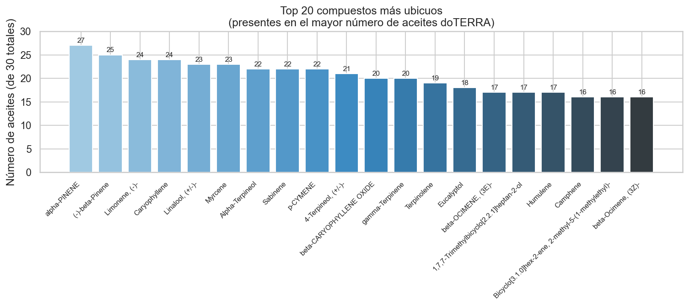
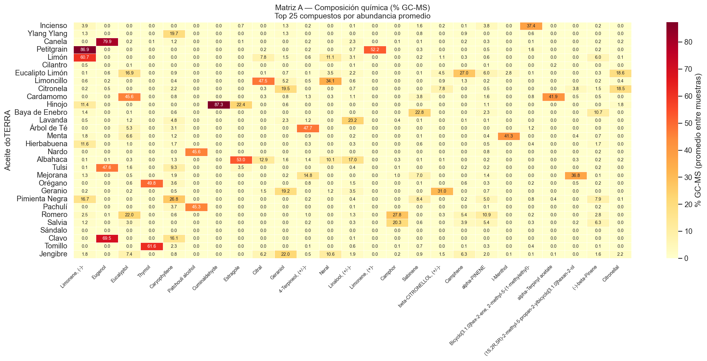
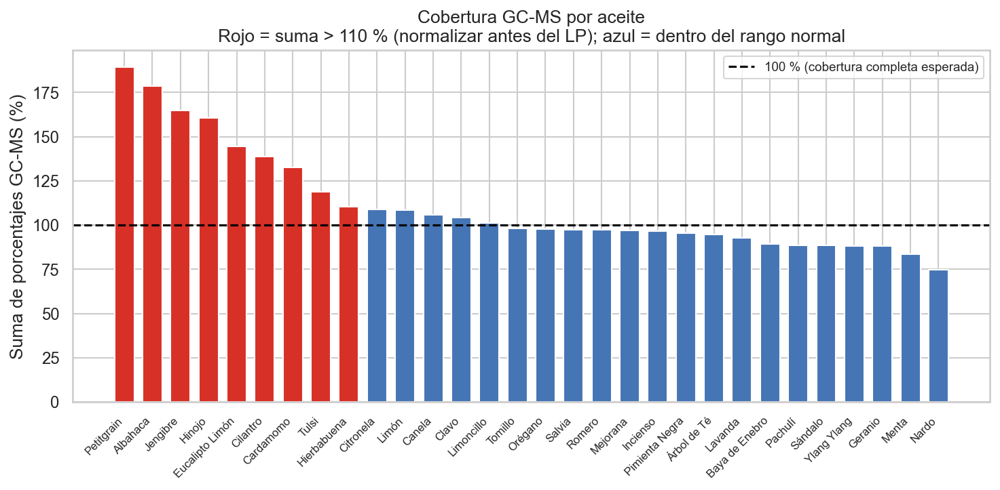
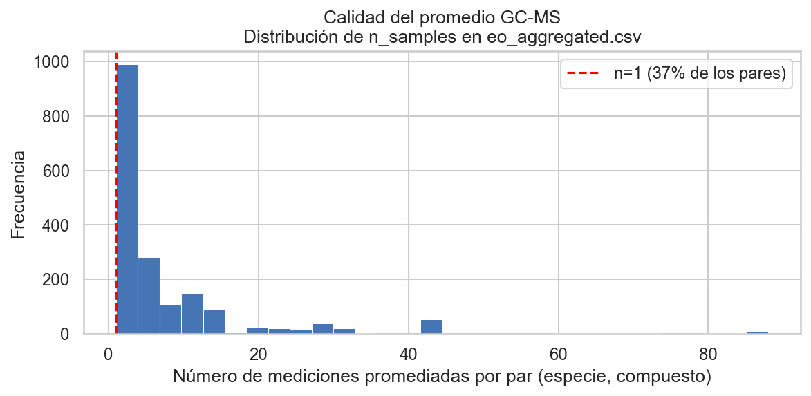
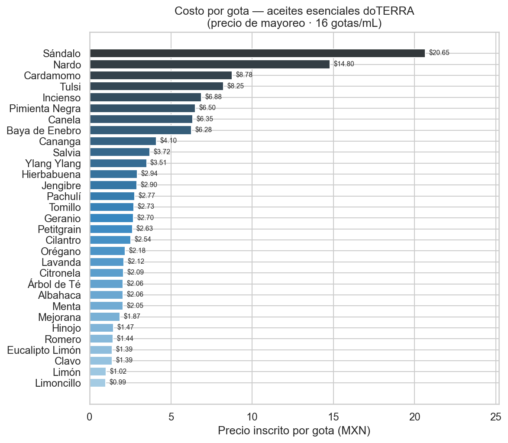
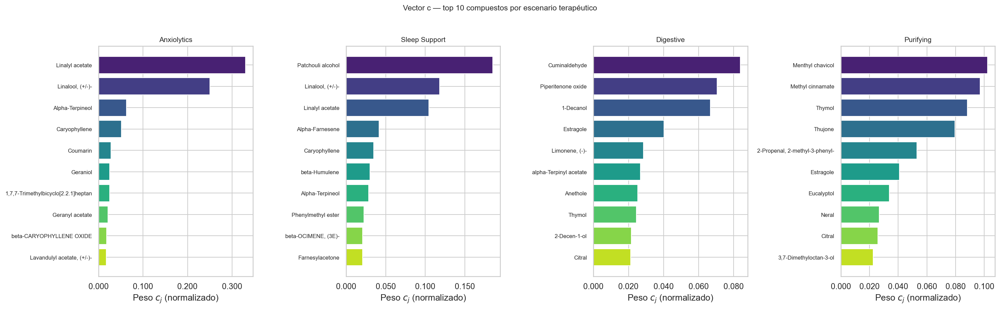

# Proyecto Final — MAT-34420 Métodos Numéricos y Optimización
**ITAM · Primavera 2026 · Prof. J. Ezequiel Soto**

---

## Pendientes

- [ ] Revisar figuras de EDA generadas por `eda.py` → copiar las relevantes al notebook
- [ ] Construir `02_optimization.ipynb`
  - [ ] Cargar `matrix_A.csv`, `prices_clean.csv`, `scenarios_c.csv`
  - [ ] Normalizar filas de A con suma > 110 % antes del LP
  - [ ] Elegir escenarios a comparar (al menos 3 distintos)
  - [ ] Implementar restricciones: mezcla completa, no negatividad, presupuesto, límites por aceite
  - [ ] Resolver con Símplex (`highs-ds`) y Puntos Interiores (`highs-ipm`)
  - [ ] Comparar: valor óptimo, iteraciones, tiempo de cómputo
  - [ ] Análisis de sensibilidad: variar presupuesto B y límites máximos por aceite
  - [ ] Visualizaciones: mezcla óptima por escenario, variables duales
- [ ] Elaborar presentación PDF (10–12 min)

---

## 1. Identificación del proyecto

| Campo | Detalle |
|---|---|
| **Título** | Formulación óptima de mezclas de aceites esenciales mediante Programación Lineal |
| **Materia** | MAT-34420 — Métodos Numéricos y Optimización |
| **Integrantes** | Felipe Castro, Paulina Garza |
| **Entregables** | Notebook `.ipynb` + Presentación `.pdf` (10–12 min) |
| **Fecha de entrega** | Mayo 2026 |

---

## 2. Planteamiento del problema

### 2.1 Contexto

La aromaterapia y la naturopatía utilizan mezclas de aceites esenciales con fines terapéuticos específicos: relajación, acción antimicrobiana, estimulación cognitiva, entre otros. Cada aceite esencial tiene una **composición química característica**, determinada por cromatografía de gases acoplada a espectrometría de masas (GC-MS), que consiste en un vector de porcentajes de compuestos orgánicos volátiles (linalool, eucaliptol, mentol, limoneno, etc.).

El formato de aplicación típico es un **roll-on de 10 mL** que contiene **20–30 gotas de aceite esencial puro** más aceite de coco fraccionado como vehículo. La formulación se decide en gotas, no en mililitros.

El problema práctico es: dado un objetivo terapéutico, **¿en qué proporciones mezclar un conjunto de aceites esenciales para maximizar la presencia de los compuestos activos deseados**, respetando restricciones de seguridad, costo y formulación?

### 2.2 Por qué es un problema de Programación Lineal

- La mezcla final es una **combinación convexa** de los vectores de composición de cada aceite.
- Maximizar una suma ponderada de concentraciones es una **función objetivo lineal** en las fracciones de mezcla.
- Las restricciones de seguridad, proporciones y presupuesto son todas **restricciones lineales**.
- El problema tiene solución exacta y admite análisis de sensibilidad vía **variables duales (KKT)**.

---

## 3. Técnicas del curso a aplicar

| Técnica | Sección del curso | Rol en el proyecto |
|---|---|---|
| **Programación Lineal — Método Símplex** | §4.1 | Método principal de solución |
| **Condiciones KKT y dualidad** | §4.4 | Interpretación de restricciones activas y variables duales |
| **Método de puntos interiores** | §4.5 | Método alternativo; comparación con Símplex |

---

## 4. Datos y Análisis Exploratorio

### 4.1 Fuentes

| Archivo (raw) | Contenido | Filas |
|---|---|---|
| `essential_oil_scentindb.csv` | Composición GC-MS: planta, compuesto, % por muestra | 85,341 |
| `therapy_scentindb.csv` | Usos terapéuticos con códigos UMLS/MeSH por planta | 515 |
| `chemical_scentindb.csv` | Diccionario de compuestos: nombre canónico, SMILES, PubChem | 3,420 |
| `lista de precios doterra.xlsx` | Precios de catálogo doTERRA México 2025 | 80 productos |

**Publicación:** Samal et al. (2026). *sCentInDB*. Molecular Diversity. DOI: 10.1007/s11030-025-11215-5

### 4.2 Pipeline de limpieza — `01_data_cleaning.ipynb`

1. Cargar los 4 archivos raw con separadores correctos (los CSV de scentindb son TSV, `sep="\t"`).
2. Mapear los 31 nombres doTERRA (español) a los nombres científicos de la BD; los 30 que tienen match quedan como candidatos del LP.
3. Filtrar cada especie a su parte estándar de extracción (flor para lavanda, hoja para árbol de té, cáscara para cítricos, etc.).
4. Normalizar nombres de compuestos haciendo join por EOCID con el diccionario canónico.
5. Agregar: promedio de % GC-MS por par (especie, compuesto).
6. Construir matriz A con `pivot_table`.
7. Construir vectores c para 41 usos terapéuticos de la BD (scentindb) + 18 categorías derivadas del catálogo doTERRA.

### 4.3 Artefactos en `data/clean/`

| Archivo | Dimensiones / Filas | Uso en el modelo |
|---|---|---|
| `matrix_A.csv` | 30 × 617 | Parámetros $a_{ij}$ |
| `scenarios_c.csv` | 59 × 617 | Vectores $c$ (uno por escenario terapéutico) |
| `prices_clean.csv` | 31 filas | Parámetros $p_i$ (precio por gota, inscrito) |
| `eo_aggregated.csv` | 1,807 filas | Tabla larga con media/std/n por (especie, compuesto) |
| `therapy_clean.csv` | 196 filas | Referencia: qué plantas → qué usos terapéuticos |
| `doterra_categories_ref.csv` | 142 filas | Qué plantas de referencia definen cada categoría doTERRA |

### 4.4 Hallazgos EDA

#### Matriz A — Composición química

- **Dimensiones:** 30 aceites × 617 compuestos únicos.
- **Sparsity:** 90.2 % de las celdas son 0. Cada aceite contiene en promedio ~60 compuestos.
- **Cobertura GC-MS:** 9 de los 30 aceites tienen suma de porcentajes > 110 %, producto de promediar muestras de distintos estudios. Se normalizarán fila a fila antes de resolver el LP: `A_norm = A.div(A.sum(axis=1), axis=0) * 100`.
- **Compuestos más ubicuos** (presentes en más de 20 aceites de los 30):

| Compuesto | Aceites que lo contienen |
|---|:---:|
| α-Pinene | 27 / 30 |
| β-Pinene | 25 / 30 |
| Limonene, (-)- | 24 / 30 |
| Caryophyllene | 24 / 30 |
| Linalool, (+/-)- | 23 / 30 |







#### Calidad de los promedios GC-MS

El 50 % de los pares (especie, compuesto) tienen sólo 1–2 mediciones; el máximo es 88. Los compuestos con más muestras corresponden a las plantas más estudiadas (Piper nigrum, Zingiber officinale, Ocimum basilicum). Los porcentajes con n = 1 se incluyen con advertencia; el modelo es robusto a variación individual dado que el óptimo depende del perfil global del aceite, no de un compuesto aislado.



#### Precios por gota (unidad del modelo)

El presupuesto del LP se expresa en **MXN por gota de aceite esencial** (no por mL), porque la formulación práctica de un roll-on se hace contando gotas. La conversión usa el estándar doTERRA de **16 gotas/mL** (verificado en la columna `Gtas x frasco` del catálogo).

$$p_i^{\text{gota}} = \frac{\text{Costo Inscritos}_i}{\text{Gtas}_i} = \frac{\text{precio\_por\_mL}_i}{16}$$

| Aceite | MXN / gota |
|---|:---:|
| Sándalo (más caro) | $20.65 |
| Nardo | $14.80 |
| Cardamomo | $8.78 |
| … | … |
| Romero | $1.44 |
| Limón | $1.02 |
| Limoncillo (más barato) | $0.99 |



#### Vectores c — escenarios terapéuticos

`scenarios_c.csv` contiene 59 escenarios:

- **41 de scentindb** (literatura farmacológica): Anti-Bacterial, Antifungal, Anxiolytics, Anti-Inflammatory, Antioxidant, Analgesics, etc.
- **18 de doTERRA** (catálogo de beneficios): Digestive Support, Sleep Support, Stress Relief, Respiratory Support, Skin Care, Purifying and Cleansing, etc.

Cada fila es un vector normalizado ($\sum_j c_j = 1$). Los pesos reflejan el perfil químico promedio de las plantas asociadas a ese uso terapéutico en la BD. Ejemplos:

| Escenario | Compuesto dominante | $c_j$ |
|---|---|:---:|
| Anxiolytics | Linalyl acetate | 0.33 |
| Sleep Support | Linalyl acetate | 0.10 |
| Oral Health | Eugenol | 0.25 |
| Grounding & Meditation | Patchouli alcohol | 0.14 |
| Energy and Uplifting | Limonene, (-)- | 0.09 |



---

## 5. Modelo matemático

### 5.1 Variables de decisión

$$x_i \in [0, 1], \quad i = 1, \ldots, n$$

donde $x_i$ es la **fracción de gotas** del aceite $i$ en la mezcla terapéutica.  
*Ejemplo: si se prepara un roll-on con 25 gotas totales, el aceite $i$ contribuye $25 \cdot x_i$ gotas.*

### 5.2 Parámetros y datos de origen

| Símbolo | Descripción | Archivo en `data/clean/` | Columna |
|---|---|---|---|
| $a_{ij}$ | % del compuesto $j$ en el aceite $i$ (promedio GC-MS) | `matrix_A.csv` | todas las columnas de compuestos |
| $c_j$ | Peso terapéutico del compuesto $j$ para el escenario elegido | `scenarios_c.csv` | columna del escenario |
| $p_i$ | Precio por gota del aceite $i$ (costo inscrito) | `prices_clean.csv` | `precio_por_gota` |
| $d_j^{max}$ | Concentración máxima permitida del compuesto $j$ | IFRA / Tisserand & Young | — |
| $u_i$ | Proporción máxima del aceite $i$ en la mezcla | Criterio aromaterapia | — |
| $B$ | Presupuesto máximo por gota de mezcla (MXN) | Definido por escenario | — |

### 5.3 Función objetivo

$$\max_{x} \quad \sum_{j=1}^{m} c_j \left( \sum_{i=1}^{n} a_{ij}\, x_i \right) = \max_{x} \quad c^T A^T x$$

### 5.4 Restricciones

$$\sum_{i=1}^{n} x_i = 1 \tag{mezcla completa}$$

$$x_i \geq 0 \quad \forall i \tag{no negatividad}$$

$$\sum_{i=1}^{n} a_{ij}\, x_i \leq d_j^{max} \quad \forall j \tag{seguridad por compuesto}$$

$$x_i \leq u_i \quad \forall i \tag{límite por aceite}$$

$$\sum_{i=1}^{n} p_i\, x_i \leq B \tag{presupuesto en MXN/gota}$$

### 5.5 Forma estándar para `scipy.optimize.linprog`

Dado que `linprog` minimiza, se convierte el problema:

$$\min_{x} \quad -c^T A^T x \quad \text{s.a.} \quad A_{ub}\,x \leq b_{ub},\; A_{eq}\,x = b_{eq},\; 0 \leq x \leq u$$

```python
# Nota de implementación: normalizar A antes de construir el LP
A_norm = A.div(A.sum(axis=1), axis=0) * 100   # filas que sumen 100%

# Cargar c para el escenario elegido
c_vec = scenarios_df.loc["Sleep Support"].values

# Función objetivo (negada para minimizar)
c_obj = -(A_norm.values.T @ c_vec)   # shape (n_oils,)

# Restricción de presupuesto (desigualdad)
p     = prices.set_index("ACEITES")["precio_por_gota"].reindex(A_norm.index).values
A_ub  = p.reshape(1, -1)
b_ub  = np.array([B])

# Restricción de mezcla completa (igualdad)
A_eq  = np.ones((1, len(A_norm)))
b_eq  = np.array([1.0])

bounds = [(0, u_i) for u_i in u]   # u_i = 0.4 por defecto
```

---

## 5-Alt. Solución alternativa: Método de Puntos Interiores (Barrera Logarítmica)

> Esta sección es complementaria al modelo de la Sección 5. Se usa el **mismo problema PL**, pero se resuelve con un algoritmo distinto para comparar convergencia, número de iteraciones y valor óptimo obtenido.

### 5-Alt.1 Idea central del método

El método de puntos interiores transforma el problema con restricciones de desigualdad en una **sucesión de problemas sin restricciones** mediante una función de barrera logarítmica que penaliza acercarse a los bordes del conjunto factible.

Para cada restricción de desigualdad $g_k(x) \leq 0$, se añade al objetivo el término:

$$-\mu \sum_{k} \ln(-g_k(x))$$

donde $\mu > 0$ es el **parámetro de barrera**. El algoritmo reduce $\mu \to 0$ iterativamente, de modo que la solución de cada subproblema converge a la solución óptima del problema original.

### 5-Alt.2 Formulación con barrera para nuestro problema

Partiendo de la forma estándar con variables de holgura $s \geq 0$:

$$A_{ub}\,x + s = b_{ub}, \quad s \geq 0$$

El subproblema de barrera en cada iteración $t$ es:

$$\min_{x,\, s} \quad -c^T A^T x - \mu \sum_{k} \ln(s_k)$$

$$\text{s.a.} \quad A_{ub}\,x + s = b_{ub}, \quad A_{eq}\,x = b_{eq}$$

Las condiciones de optimalidad (KKT) del subproblema dan lugar al **sistema de Newton** que se resuelve en cada paso:

$$\begin{pmatrix} 0 & A_{ub}^T & A_{eq}^T \\ A_{ub} & -S^{-1}Z & 0 \\ A_{eq} & 0 & 0 \end{pmatrix} \begin{pmatrix} \Delta x \\ \Delta s \\ \Delta \lambda \end{pmatrix} = -\begin{pmatrix} r_d \\ r_p \\ r_e \end{pmatrix}$$

donde $S = \text{diag}(s)$, $Z = \text{diag}(\lambda_s)$, y $r_d, r_p, r_e$ son los residuos de dualidad, primalidad y complementariedad.

### 5-Alt.3 Criterio de paro

El algoritmo termina cuando se satisfacen simultáneamente:

$$\frac{\|r_p\|}{1 + \|b\|} \leq \varepsilon, \quad \frac{\|r_d\|}{1 + \|c\|} \leq \varepsilon, \quad \frac{x^T s}{n} \leq \varepsilon$$

con tolerancia típica $\varepsilon = 10^{-8}$.

### 5-Alt.4 Implementación en Python

`scipy.optimize.linprog` soporta puntos interiores de forma nativa cambiando un solo parámetro:

```python
from scipy.optimize import linprog

# Símplex revisado (método principal)
res_simplex = linprog(c_obj, A_ub=A_ub, b_ub=b_ub,
                      A_eq=A_eq, b_eq=b_eq,
                      bounds=bounds,
                      method='highs-ds')   # dual simplex

# Puntos interiores (método alternativo)
res_ipm = linprog(c_obj, A_ub=A_ub, b_ub=b_ub,
                  A_eq=A_eq, b_eq=b_eq,
                  bounds=bounds,
                  method='highs-ipm')      # interior point
```

### 5-Alt.5 Tabla de comparación Símplex vs. Puntos Interiores

| Criterio | Símplex (revisado) | Puntos Interiores |
|---|---|---|
| **Trayectoria** | Recorre vértices del poliedro factible | Atraviesa el interior del poliedro |
| **Iteraciones** | Pocas en problemas pequeños | Más iteraciones, cada una más costosa |
| **Convergencia** | Exacta en un vértice | Asintótica (se acerca al óptimo) |
| **Variables duales** | Directamente disponibles al terminar | Requieren recuperación del sistema KKT |
| **Sensibilidad** | Análisis de rango exacto | Aproximado vía perturbación |
| **Complejidad teórica** | Exponencial (peor caso) | Polinomial |
| **Aplicación en este proyecto** | Solución principal + análisis de sensibilidad | Verificación del óptimo y comparación |

### 5-Alt.6 Qué se compara en el notebook

Para cada escenario analizado se reporta:

| Métrica | Símplex | Puntos Interiores |
|---|---|---|
| Valor óptimo $z^*$ | — | — |
| Solución $x^*$ (fracciones por aceite) | — | — |
| Número de iteraciones | — | — |
| Tiempo de cómputo (ms) | — | — |
| Restricciones activas | — | — |

> Se espera que ambos métodos lleguen al **mismo $z^*$**, pero por caminos distintos.

---

## 6. Escenarios de optimización

Los escenarios se generan dinámicamente desde `scenarios_c.csv`, que contiene **59 vectores c** listos para usar:

```python
scenarios_df = pd.read_csv("data/clean/scenarios_c.csv", index_col=0)

# Elegir cualquier escenario por nombre
c_vec = scenarios_df.loc["Sleep Support"].values
c_vec = scenarios_df.loc["Anti-Bacterial Agents"].values
c_vec = scenarios_df.loc["Purifying and Cleansing"].values
```

### Escenarios sugeridos para el notebook (representativos y diversos)

| Escenario | Fuente | Compuesto dominante | Interés del análisis |
|---|---|---|---|
| **Anxiolytics** | scentindb | Linalyl acetate (0.33) | Benchmark clínico; lavanda domina |
| **Sleep Support** | doTERRA | Linalyl acetate (0.10) | Similar a Anxiolytics pero más balanceado |
| **Anti-Bacterial Agents** | scentindb | — | 30/30 aceites útiles; problema denso |
| **Oral Health** | doTERRA | Eugenol (0.25) | Clavo domina; presupuesto restrictivo |
| **Purifying and Cleansing** | doTERRA | Eucalyptol (0.03) | Múltiples aceites económicos competitivos |

### Cómo se construyó cada vector c

Para los escenarios de **scentindb**: se toman todas las plantas del mundo con ese uso terapéutico registrado en la BD (sin filtrar a doTERRA), se promedian sus perfiles GC-MS, y se normaliza.

Para los escenarios de **doTERRA**: se asignan las especies botánicas cuyas descripciones en el catálogo mencionan explícitamente ese beneficio; se aplica el mismo procedimiento de promedio y normalización.

---

## 7. Estructura del notebook `02_optimization.ipynb`

### Sección 1 — Introducción
- Contexto del problema y motivación
- Conexión con el notebook de limpieza (`01_data_cleaning.ipynb`)

### Sección 2 — Marco teórico *(resumen)*
- Programación Lineal: forma estándar, poliedro factible
- Símplex vs. Puntos Interiores

### Sección 3 — Carga y preparación de datos
```python
A         = pd.read_csv("data/clean/matrix_A.csv",    index_col=0)
scenarios = pd.read_csv("data/clean/scenarios_c.csv", index_col=0)
prices    = pd.read_csv("data/clean/prices_clean.csv")

# Normalizar A (9 aceites tienen suma de fila > 110%)
A_norm = A.div(A.sum(axis=1), axis=0) * 100
```

### Sección 4 — Implementación del LP
- Construcción de `c_obj`, `A_ub`, `b_ub`, `A_eq`, `b_eq`, `bounds`
- Función auxiliar `solve_scenario(scenario_name, budget_per_drop, u_max)`
- Resolver con `highs-ds` (Símplex) y `highs-ipm` (Puntos Interiores)

### Sección 5 — Resultados y comparación de métodos
- Tabla: $z^*$, iteraciones, tiempo por método
- Gráfica de barras apiladas: mezcla óptima $x^*$ por escenario
- Interpretación de variables duales

### Sección 6 — Análisis de sensibilidad
- Variación del presupuesto $B$: curva $z^*$ vs. $B$
- Variación de $u_i$ (límite máximo por aceite): impacto en diversidad de la mezcla

### Sección 7 — Conclusiones
- Comparación Símplex vs. Puntos Interiores
- Limitaciones y extensiones posibles

---

## 8. Librerías y herramientas

```python
pandas          # carga y manipulación de artefactos data/clean/
numpy           # álgebra lineal, construcción de A, b, c
scipy.optimize  # linprog (Símplex + Interior Point vía HiGHS)
matplotlib      # gráficas de resultados
seaborn         # heatmap de composición (EDA)
```

**Solver:** `scipy.optimize.linprog` con `method='highs'` — soporta Símplex revisado (`highs-ds`) y puntos interiores (`highs-ipm`).

---

## 9. Referencias

1. Samal, A. et al. (2026). sCentInDB: a database of essential oil chemical profiles of Indian medicinal plants. *Molecular Diversity*. https://doi.org/10.1007/s11030-025-11215-5
2. Tisserand, R. & Young, R. (2014). *Essential Oil Safety* (2nd ed.). Churchill Livingstone.
3. Soto, J. E. (2026). Notas del curso MAT-34420 — Sección 4.1: Programación Lineal y Método Símplex. ITAM. https://itam-ds.github.io/analisis-numerico-computo-cientifico/
4. IFRA (International Fragrance Association). IFRA Standards — Concentration limits by compound and application category. https://ifrafragrance.org
5. doTERRA International. Source to You — GC/MS batch testing reports. https://sourcetoyou.doterra.com
6. Virtanen, P. et al. (2020). SciPy 1.0: Fundamental algorithms for scientific computing in Python. *Nature Methods*, 17, 261–272.
